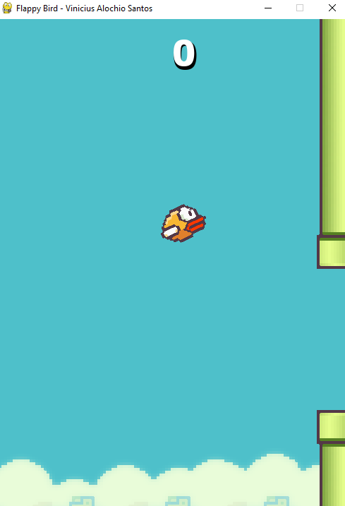
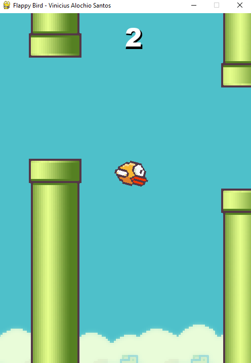

# Flappy Bird em Python

Neste repositório se encontra o codígo do jogo Flappy Bird, utilizando o pygame. O desenvolvimento desse jogo foi durante uma maratona de desenvolvimento da hashtag treinamentos.
##

  

	  
	  
  

